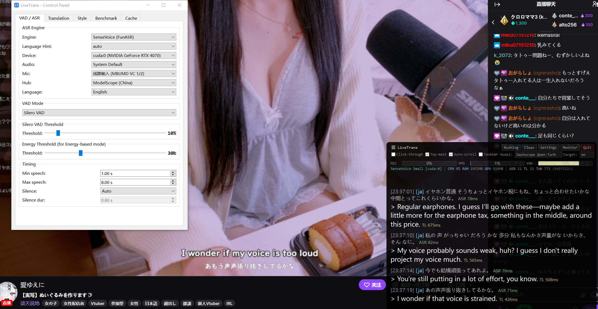

# OneBoard Live Translate

**English** | [中文](README_zh.md)

OneBoard Live Translate is free and open-source software licensed under
**GPL-3.0-only**. It is a Windows product layer over
[TheDeathDragon/LiveTranslate](https://github.com/TheDeathDragon/LiveTranslate).
It focuses the primary workflow on English ↔ Vietnamese while retaining the
upstream engines, languages, overlay, and diagnostics under Advanced.

It captures system audio (WASAPI loopback) and optional microphone input, runs
ASR, translates through a local or compatible LLM API, and shows accumulated
source and translation text in two readable panes.

Works with any system audio — videos, livestreams, voice chat. No player modifications needed.


Binary dependencies and separately downloaded models retain their own licenses.
See [THIRD_PARTY_NOTICES.md](THIRD_PARTY_NOTICES.md) and the current
[release licensing review](RELEASE_LICENSING_REVIEW.md) before distribution.

## Screenshot



This inherited image shows the upstream Advanced interface, not the current
OneBoard primary window. Replace it with a controlled OneBoard screenshot before
v1.0.

## Video

[](https://www.bilibili.com/video/BV1K2Awz6Euw)

## Features

- **Real-time pipeline**: System audio → VAD → ASR → LLM translation → overlay
- **Multiple ASR engines**: faster-whisper, SenseVoice, FunASR Nano, Anime-Whisper
- **Remote ASR**: offload speech recognition to a GPU machine over HTTP — see [REMOTE_ASR.md](REMOTE_ASR.md)
- **Any OpenAI-compatible API**: DeepSeek, Grok, Qwen, GPT, Ollama, vLLM, etc.
- **Streaming translation display**: Real-time character-by-character translation output
- **Per-model settings**: Streaming, structured output (JSON), context history, disable thinking
- **Microphone mix-in**: Optionally mix microphone input with system audio for ASR
- **Low-latency VAD**: 32ms chunks + Silero VAD with adaptive silence detection
- **Transparent overlay**: Always-on-top, click-through, draggable, 14 color themes
- **CUDA acceleration**: GPU-accelerated ASR inference
- **Auto model management**: Setup wizard, ModelScope / HuggingFace dual sources
- **Built-in benchmark**: Compare translation model speed and quality

## Changelog

See [English Changelog](i18n/CHANGELOG_en.md) | [中文更新日志](i18n/CHANGELOG_zh.md)

## Requirements

- **OS**: Windows 10/11
- **Python**: 3.10–3.12 (or use the portable build)
- **GPU** (recommended): NVIDIA + CUDA 12.6 (Blackwell GPUs like RTX 50xx require CUDA 12.8)
- **Network**: Access to a translation API

## Quick Start

### Portable build (no Python required, recommended for non-developers)

Extract `OneBoardLiveTranslate-<version>-win-x64.zip` and open
**`OneBoardLiveTranslate.exe`**. Python and runtime dependencies are included;
speech and translation models remain separately manageable and download only
after explicit approval. No public OneBoard release endpoint is configured yet,
so upstream LiveTranslate releases must not be presented as OneBoard packages.

### Developer source checkout

The inherited `install.*`, `start.bat`, and `update.bat` files remain for
source-checkout development. They are excluded from OneBoard customer packages;
`update.bat` is not a customer updater. See [PACKAGING.md](PACKAGING.md) for the
clean OneBoard build and verification commands.

Double-click **`install.bat`** — the installer will:
1. Detect Python 3.10–3.12 (auto-install via winget if missing)
2. Create a virtual environment
3. Auto-detect NVIDIA GPU and let you choose CUDA / CPU PyTorch
4. Install all dependencies

Then double-click **`start.bat`** to launch.

**`update.bat`** runs plain `git pull`, so it follows the current branch's
configured tracking branch and then updates dependencies; it does not
specifically fetch the Git remote named `upstream`. For an intentional upstream
sync, use an explicit `git fetch upstream`, review the changes, and integrate
them into `oneboard-dev` under the repository policy. Never expose this script
as the OneBoard customer update path.

<details>
<summary>Manual install</summary>

```bash
python -m venv .venv
.venv\Scripts\activate

# PyTorch (choose one)
pip install torch torchaudio --index-url https://download.pytorch.org/whl/cu126  # CUDA
pip install torch torchaudio --index-url https://download.pytorch.org/whl/cu128  # CUDA (RTX 50xx)
pip install torch torchaudio --index-url https://download.pytorch.org/whl/cpu    # CPU only

# Dependencies
pip install -r requirements.txt

# Launch
.venv\Scripts\python.exe main.py
```

</details>

## First Launch

1. The OneBoard wizard checks Windows, audio, speech recognition, and Ollama.
2. Whisper Small and the selected Ollama model are downloaded only after approval.
3. The app still opens if setup is postponed; Start explains any blocking item.

## Translation API

Settings → Translation tab:

| Parameter | Example |
|-----------|---------|
| API Base | `http://127.0.0.1:11434/v1` |
| API Key | `ollama` for the local default |
| Model | `qwen3:4b-instruct-2507-q4_K_M` |
| Proxy | `none` / `system` / custom URL |

## Architecture

```
Audio (WASAPI 32ms) → VAD (Silero) → ASR → LLM Translation → OneBoard UI
         ↑ optional mic mix-in
```

```
main.py                 Upstream pipeline + OneBoard entry point
├── oneboard_app.py     Product controller and Advanced adapter
├── oneboard_ui.py      Compact product Control Window
├── oneboard_display_window.py Dedicated transcript Display Window
├── oneboard_transcript_view.py Ordered, bounded transcript panes
├── audio_capture.py    WASAPI loopback + mic mix-in
├── vad_processor.py    Silero VAD
├── asr_engine.py       faster-whisper backend
├── asr_funasr.py       Unified FunASR model selector backend
├── asr_sensevoice.py   SenseVoice backend
├── asr_funasr_nano.py  FunASR Nano backend
├── asr_anime_whisper.py Anime-Whisper backend (ja anime/galgame)
├── asr_remote.py        Remote Whisper client (→ asr_server.py, see REMOTE_ASR.md)
├── translator.py       OpenAI-compatible client (streaming, JSON schema, context)
├── model_manager.py    Model download & cache
├── subtitle_overlay.py PyQt6 overlay
├── control_panel.py    Settings UI (7 tabs)
├── dialogs.py          Wizard, download & model config dialogs
└── benchmark.py        Translation benchmark
```

## Acknowledgements

- [LiveTranslate](https://github.com/TheDeathDragon/LiveTranslate) — upstream core retained by this minimal fork
- [faster-whisper](https://github.com/SYSTRAN/faster-whisper) — Whisper inference via CTranslate2
- [FunASR](https://github.com/modelscope/FunASR) — SenseVoice / Fun-ASR-Nano
- [Anime-Whisper](https://huggingface.co/litagin/anime-whisper) — Japanese anime/galgame ASR
- [Silero VAD](https://github.com/snakers4/silero-vad) — Voice activity detection

## License

OneBoard Live Translate is completely free and open-source software distributed
under the [GNU General Public License v3.0 only](LICENSE) (`GPL-3.0-only`). You
may use, study, modify, and redistribute it under those terms. The corresponding
source for every official binary release is made available from the exact
matching Git tag.

This project is based on the open-source
[LiveTranslate](https://github.com/TheDeathDragon/LiveTranslate) project. Its
copyright notice and exact MIT license are preserved in
[`LICENSES/LiveTranslate-MIT.txt`](LICENSES/LiveTranslate-MIT.txt). Third-party
software and separately downloaded models retain their own terms; see
[`THIRD_PARTY_NOTICES.md`](THIRD_PARTY_NOTICES.md).
