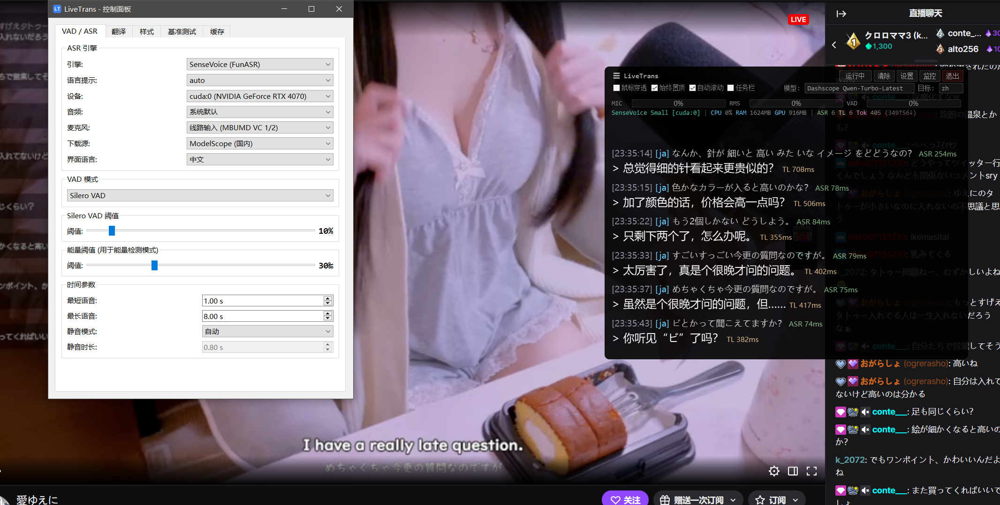

# OneBoard Live Translate

[English](README.md) | **中文**

OneBoard Live Translate 是基于
[TheDeathDragon/LiveTranslate](https://github.com/TheDeathDragon/LiveTranslate)
上游核心构建的 Windows 产品层。主界面优先支持英语与越南语互译，同时在“高级”中保留上游的其他语言、引擎、悬浮窗和诊断功能。

它捕获系统音频（WASAPI loopback）和可选的麦克风输入，完成语音识别和 LLM 翻译，并在上下两个连续文本区域中显示原文与译文。

适用于看外语视频、直播、语音对话等场景——无需修改播放器，全局音频捕获即开即用。


OneBoard Live Translate 是完全免费且开源的软件，采用 GNU 通用公共许可证
第 3 版（仅该版本，`GPL-3.0-only`）发布。它基于开源项目 LiveTranslate，
并完整保留上游版权和 MIT 许可证署名。


二进制依赖和另行下载的模型保留各自的许可证。发布前请查看
[THIRD_PARTY_NOTICES.md](THIRD_PARTY_NOTICES.md) 和当前的
[发布许可审查](RELEASE_LICENSING_REVIEW.md)。

## 截图



此继承图片展示的是上游高级界面，并非当前 OneBoard 主窗口。v1.0 发布前应使用
内容可控的 OneBoard 截图替换它。

## 安装视频

[](https://www.bilibili.com/video/BV1K2Awz6Euw) 适用于看外语视频、直播、ASMR等场景，也可以语音输入实时并行翻译多种语音

## 功能特性

- **实时翻译管线**：系统音频 → VAD → ASR → LLM 翻译 → 字幕显示
- **多 ASR 引擎**：faster-whisper、SenseVoice、FunASR Nano、Anime-Whisper
- **远程 ASR**：通过 HTTP 把语音识别放到 GPU 机器上跑 —— 见 [REMOTE_ASR.md](REMOTE_ASR.md)
- **兼容任意 OpenAI 格式 API**：DeepSeek、Grok、Qwen、GPT、Ollama、vLLM 等
- **流式翻译显示**：翻译结果逐字实时显示
- **模型独立配置**：流式传输、结构化输出(JSON)、上下文历史、禁用思考
- **麦克风混音**：可选将麦克风输入混合到系统音频一起识别
- **低延迟 VAD**：32ms 音频块 + Silero VAD，自适应静音检测
- **透明悬浮窗**：始终置顶、鼠标穿透、可拖拽，14 种配色主题
- **CUDA 加速**：ASR 模型 GPU 推理
- **模型自动管理**：首次启动向导，支持 ModelScope / HuggingFace 双源
- **内置基准测试**：对比翻译模型速度和质量

## 更新日志

查看 [中文更新日志](i18n/CHANGELOG_zh.md) | [English Changelog](i18n/CHANGELOG_en.md)

## 系统要求

- **操作系统**：Windows 10/11
- **Python**：3.10–3.12（绿色版免装）
- **GPU**（推荐）：NVIDIA 显卡 + CUDA 12.6（RTX 50 系列等 Blackwell 架构需要 CUDA 12.8）
- **网络**：需要访问翻译 API

## 快速开始

### 绿色版（免装 Python，推荐新手）

解压 `OneBoardLiveTranslate-<version>-win-x64.zip`，然后双击
**`OneBoardLiveTranslate.exe`**。软件包已包含 Python 和运行时依赖；语音与翻译模型单独管理，并且只会在用户明确同意后下载。目前尚未配置公开的 OneBoard 发布地址，因此不得把上游 LiveTranslate 发布包作为 OneBoard 软件包提供。

### 开发者源码工作区

继承的 `install.*`、`start.bat` 和 `update.bat` 仅保留给源码工作区开发，
不会进入 OneBoard 客户软件包；`update.bat` 不是客户更新程序。OneBoard 的干净构建与验证命令见 [PACKAGING.md](PACKAGING.md)。

双击 **`install.bat`** 一键安装——脚本会自动：
1. 检测 Python 3.10–3.12（未安装则通过 winget 自动安装）
2. 创建虚拟环境
3. 检测 NVIDIA 显卡，选择 CUDA / CPU 版 PyTorch
4. 安装全部依赖

安装完成后双击 **`start.bat`** 启动。

**`update.bat`** 执行普通的 `git pull`，因此它会拉取当前分支所配置的跟踪分支，
然后更新依赖；它并不会专门拉取名为 `upstream` 的 Git 远程。若要有意同步上游，
请明确执行 `git fetch upstream`，审查变更，并依照仓库策略将其集成到
`oneboard-dev`；不得把该脚本作为 OneBoard 客户更新路径。

<details>
<summary>手动安装</summary>

```bash
python -m venv .venv
.venv\Scripts\activate

# PyTorch（三选一）
pip install torch torchaudio --index-url https://download.pytorch.org/whl/cu126  # CUDA
pip install torch torchaudio --index-url https://download.pytorch.org/whl/cu128  # CUDA（RTX 50 系列）
pip install torch torchaudio --index-url https://download.pytorch.org/whl/cpu    # 仅 CPU

# 依赖
pip install -r requirements.txt

# 启动
.venv\Scripts\python.exe main.py
```

</details>

## 首次使用

1. OneBoard 向导检查 Windows、音频、语音识别和 Ollama。
2. Whisper Small 和所选 Ollama 模型只会在用户同意后下载。
3. 用户可以暂缓设置并进入应用；点击“开始”时会说明尚缺的必要项目。

## 配置翻译 API

设置 → 翻译标签页：

| 参数 | 示例 |
|------|------|
| API Base | `http://127.0.0.1:11434/v1` |
| API Key | 本地默认值 `ollama` |
| Model | `qwen3:4b-instruct-2507-q4_K_M` |
| 代理 | `none` / `system` / 自定义地址 |

## 架构

```
Audio (WASAPI 32ms) → VAD (Silero) → ASR → LLM Translation → OneBoard UI
         ↑ 可选麦克风混音
```

```
main.py                 上游管线和 OneBoard 入口
├── oneboard_app.py     产品控制器和高级功能适配层
├── oneboard_ui.py      上下双文本区主窗口
├── audio_capture.py    WASAPI loopback + 麦克风混音
├── vad_processor.py    Silero VAD
├── asr_engine.py       faster-whisper 后端
├── asr_funasr.py       统一 FunASR 模型选择后端
├── asr_sensevoice.py   SenseVoice 后端
├── asr_funasr_nano.py  FunASR Nano 后端
├── asr_anime_whisper.py Anime-Whisper 后端 (日语动画/Galgame)
├── asr_remote.py        远程 Whisper 客户端 (→ asr_server.py, 见 REMOTE_ASR.md)
├── translator.py       OpenAI 兼容翻译客户端 (流式/JSON/上下文)
├── model_manager.py    模型下载与缓存管理
├── subtitle_overlay.py PyQt6 透明悬浮窗
├── control_panel.py    设置面板 UI (7 个标签页)
├── dialogs.py          设置向导、下载、模型配置对话框
└── benchmark.py        翻译基准测试
```

## 致谢

- [LiveTranslate](https://github.com/TheDeathDragon/LiveTranslate) — 本最小化分叉保留的上游核心
- [faster-whisper](https://github.com/SYSTRAN/faster-whisper) — 基于 CTranslate2 的 Whisper 推理
- [FunASR](https://github.com/modelscope/FunASR) — SenseVoice / Fun-ASR-Nano
- [Anime-Whisper](https://huggingface.co/litagin/anime-whisper) — 日语动画/Galgame 专用 ASR
- [Silero VAD](https://github.com/snakers4/silero-vad) — 语音活动检测

## 许可证

OneBoard Live Translate 采用 [GNU GPL v3（仅第 3 版）](LICENSE)
（`GPL-3.0-only`）授权，可依照许可证条款免费使用、研究、修改和再分发。
每个官方二进制发布包都必须对应完全匹配的 Git 标签，并提供该标签的源代码。

LiveTranslate 上游版权声明及其完整 MIT 许可证保存在
[`LICENSES/LiveTranslate-MIT.txt`](LICENSES/LiveTranslate-MIT.txt)。第三方软件
和另行下载的模型采用各自的许可条款；详见
[`THIRD_PARTY_NOTICES.md`](THIRD_PARTY_NOTICES.md)。
